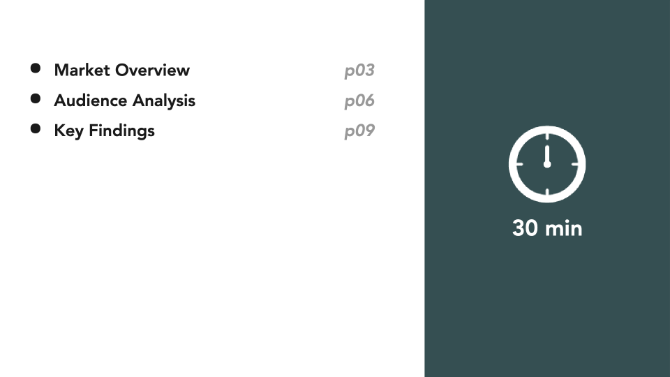
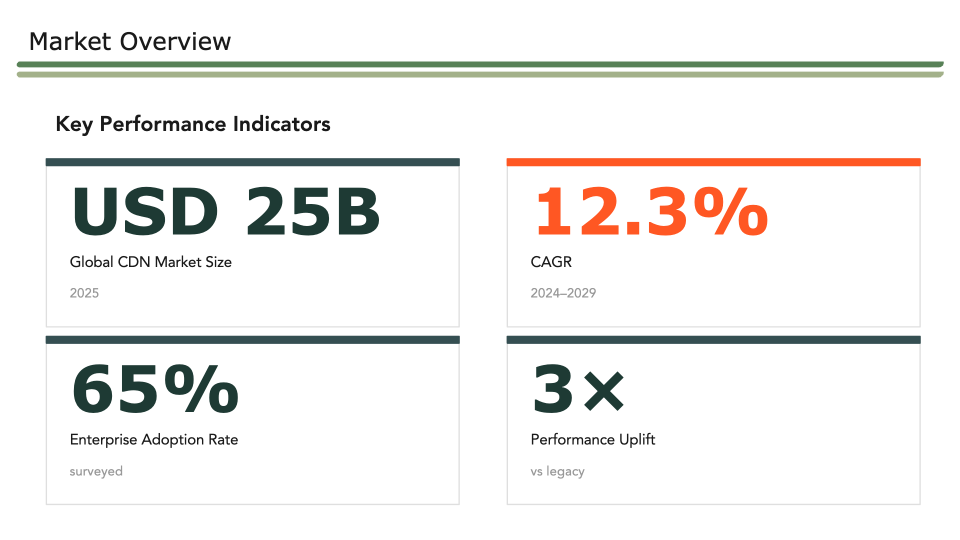
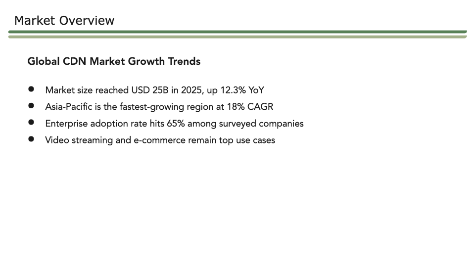
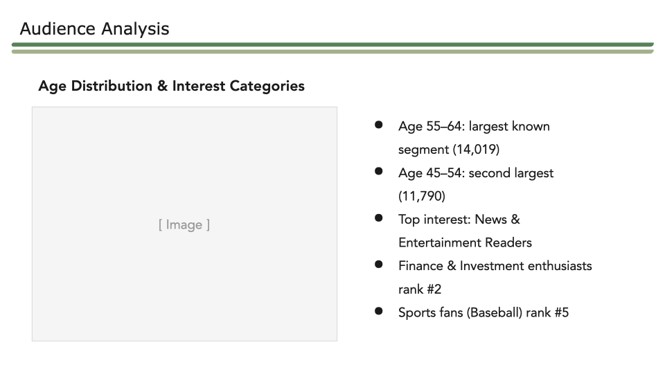
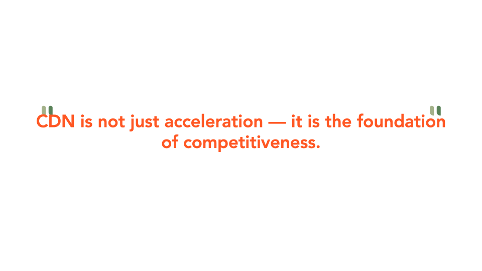
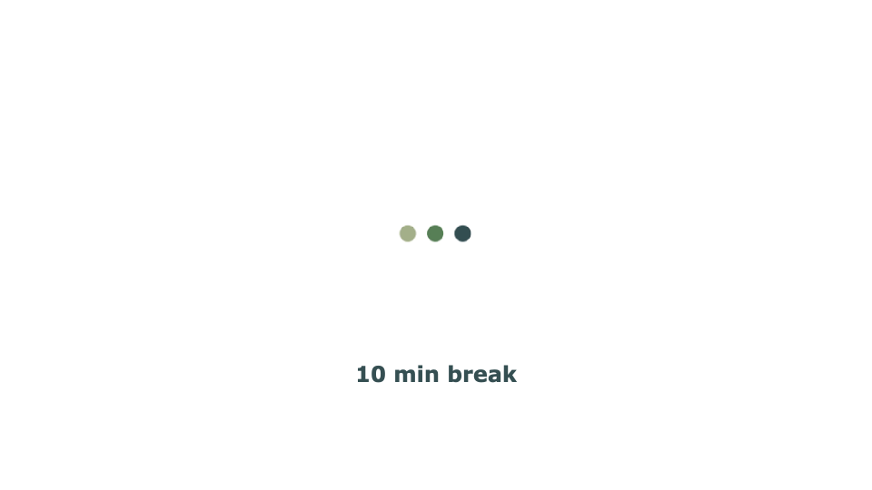

# Mlytics Slide Brand Skill 使用指南

> 適用對象：所有需要用 Claude Code 製作 Mlytics 品牌簡報的成員
> 最後更新：2026-04-28

---

## 你會做到什麼？

輸入一行指令，Claude 自動產生一份符合 Mlytics 品牌規範的 `.pptx` 簡報，存到你指定的位置，直接用 PowerPoint 或 Keynote 打開就能用。

---

## 第一步：安裝（只需做一次）

### 1. 打開終端機（Terminal）

- Mac：按 `Command + 空白鍵`，搜尋「Terminal」，按 Enter

### 2. 貼上以下兩行指令，按 Enter 執行

```bash
git clone https://github.com/<your-org>/mlytics-slide-brand.git \
  ~/.claude/skills/mlytics-slide-brand
```

```bash
cd ~/.claude/skills/mlytics-slide-brand && npm run install-skill
```

> 看到 `✅ Mlytics Slide Brand Skill 安裝完成！` 就代表安裝成功。

### 3. 確認安裝成功

```bash
ls ~/.claude/skills/mlytics-slide-brand/templates/
```

看到這些檔案名稱就代表成功：

```
base.mjs  slide-cover.mjs  slide-toc.mjs  slide-section.mjs ...
```

---

## 第二步：在 Claude Code 中使用

### 最簡單的方式

在 Claude Code 對話框輸入：

```
/mlytics-slide <你的需求>
```

### 實際範例

| 我想要什麼 | 輸入什麼 |
|-----------|---------|
| 快速產一份 5 頁報告 | `/mlytics-slide Q2 CDN 市場報告，5 頁` |
| 有章節大綱 | `/mlytics-slide AIGC 雙週報，章節：市場概況、受眾分析、熱門內容` |
| 有頁數限制 | `/mlytics-slide 年度回顧，包含 KPI 頁，12 頁以內` |
| 附上數據 Excel | 先上傳 `.xlsx` 檔案，再輸入 `/mlytics-slide AIGC 客戶報告，內容使用附件數據` |

> 💡 **小技巧**：描述越詳細，產出越精準。可以說明：報告主題、章節名稱、頁數上限、要不要特定版型。

---

## 第三步：取得檔案

Claude 執行完後，檔案會**自動存到你的桌面**，檔名依報告主題命名（英文）。

例如：`~/Desktop/Q2_CDN_Report.pptx`

直接在桌面找到檔案，用 PowerPoint 或 Keynote 打開即可。

---

## 版型介紹

Skill 共有 **9 種版型**，Claude 會自動選擇合適的版型。以下是每種版型的外觀與用途：

---

### Cover — 封面


**用途**：整份簡報的第一張，自動加上 Mlytics Logo。

**你需要提供**：
- 報告類別（小字標題）
- 主標題（支援換行）
- 報告人姓名
- 日期

---

### TOC — 目錄



**用途**：列出所有章節名稱與頁碼，固定放在第二張。

**你需要提供**：
- 章節清單（名稱 + 頁碼）
- 預計時間（選填，預設 30 min）

---

### Section Divider — 章節分隔


**用途**：宣告新章節開始，深色全版背景，視覺切換感強烈。

**你需要提供**：
- 章節標題

---

### Metrics — KPI 數據卡片



**用途**：展示 2–4 個重點數字，2×2 卡片排列，一眼看清關鍵指標。

**你需要提供**：
- 每張卡片的數字、標籤、備註
- 最想強調的那張卡片標記 `accent: true`（橘色），每頁最多 1 張

---

### Content Text — 純文字條列



**用途**：全版條列重點，適合說明性內容、數據解讀、分析摘要。

**你需要提供**：
- 章節標籤、副標題
- 條列重點（建議 4–6 點）

---

### Content Split — 左圖右文



**用途**：左側放圖表或截圖，右側放說明文字。

**你需要提供**：
- 章節標籤、副標題
- 右側條列重點
- 圖表圖片（產出後在 PowerPoint / Keynote 手動替換左側灰色框）

---

### Punchline — 強調句



**用途**：整頁只放一句核心訊息，視覺衝擊力最強。

**你需要提供**：
- 一句話（不能超過一句）

---

### Break — 中場休息



**用途**：簡報中途的休息頁或段落銜接。

**你需要提供**：
- 提示文字（選填，預設「10 min break」）

---

### Q&A — 問答


**用途**：簡報結尾的問答頁，深色背景。

**你需要提供**：
- 說明文字（選填，預設「Questions & discussion」）

---

## 標準簡報架構

不確定要幾頁、怎麼排？參考這個預設結構：

```
第 01 頁  Cover            封面（必要）
第 02 頁  TOC              目錄（必要）
第 03 頁  Section Divider  第一章開始
第 04 頁  Metrics          數字指標
第 05 頁  Content Text     說明內容
第 06 頁  Section Divider  第二章開始
第 07 頁  Content Split    圖表 + 說明
第 08 頁  Content Text     補充內容
第 09 頁  Punchline        核心訊息
第 10 頁  Break            休息（選用）
第 11 頁  Q&A              結尾問答（必要）
```

---

## 品牌顏色與字型

這些規範已內建在 Skill 裡，**不需要手動設定**，Claude 會自動套用。

| 顏色用途 | HEX |
|---------|-----|
| 深色背景（Section、Q&A） | `#354F52` |
| 主要綠色色塊 | `#4A7C59` |
| 輔助線條 | `#7A9E6E` |
| 強調橘色（最多每頁 1–2 次） | `#FF5723` |
| 內文 | `#1A1A1A` |

| 字型用途 | 字型 |
|---------|------|
| 標題 | Verdana Bold |
| 內文、條列 | Avenir |
| Q&A 說明 | Ubuntu |

---

## 常見問題

**Q：產出的 PPTX 存在哪裡？**
Claude 執行完後會顯示完整路徑，例如 `/tmp/output.pptx`。你也可以在指令中指定存放位置。

**Q：圖表要怎麼放進去？**
有兩種方式：
- **手動**：用 PowerPoint / Keynote 打開後，點選左側灰色框，直接替換成你的圖片或截圖
- **交給 AI**：在指令中附上數據檔案（`.xlsx`、`.csv`）或直接貼上數據，Claude 會根據數據自動配置圖表說明文字與條列內容

**Q：可以只產特定幾張嗎？**
可以。在指令中說明，例如：「只需要封面、兩頁內容、Q&A，共 4 頁」。

**Q：可以改中文或其他語言嗎？**
可以。直接在指令中提供中文內容，Claude 會填入正確文字。

---

*Skill 製作：An Chou*

